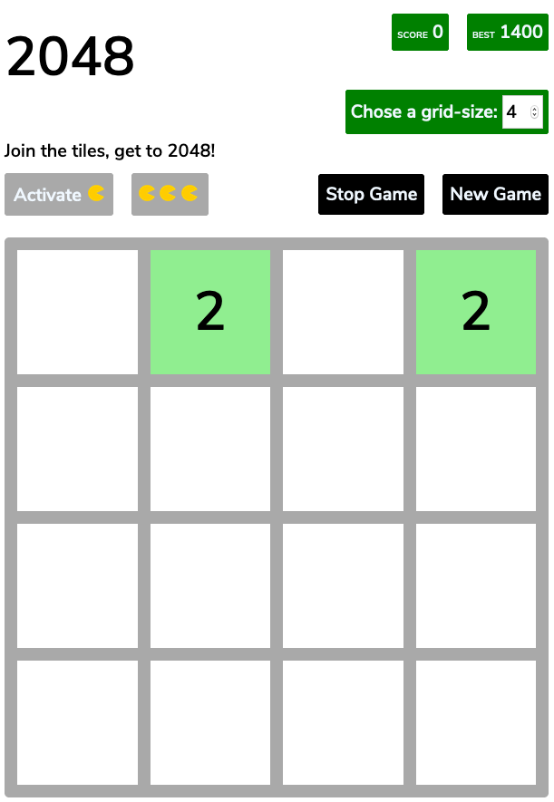
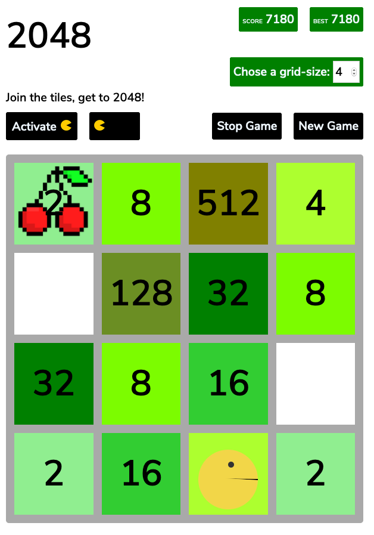

###  General Assembly, Software Engineering Immersive
# Project 1: Building a game in JavaScript

by [Jonas Bolduan](https://github.com/jonasbee)

## Overview

For my first project on the Software Engineering course at General Assembly London, I chose to build the game 2048. This was an individual project and we were given one week to apply what we had learnt in the first three weeks of the course in order to build a fully functioning game using HTML, CSS and JavaScript. 

[Take a look on GitHub Pages.](https://jonasbee.github.io/project-1/)

[Check out the GitHub Repo here.](https://github.com/jonasbee/project-1)

## Brief

The project brief:

- Render a game in the browser
- Use Javascript for DOM manipulation
- Design logic for winning & visually display when the player has won
- Include separate HTML / CSS / JavaScript files
- Deploy the game on github pages

### Game Specifications

2048 is a game where you join tiles by moving them left/right/up/down. Joined tiles value gets doubled. The goal is to get to 2048.

[Check out the original game here](https://play2048.co)

## Technologies Used

- HTML
- CSS
- JavaScript (ES6)
- Git and GitHub

---

## Approach

### Setting the foundations

Screen options
- Start/Stop button
- Adjustable grid-size (between 4 and 20)
- (Activate PacMan-mode)

Creating the grid
- wipe out everything
- create grid based on width

Adding tiles to start with
- randomly add tiles on free cells



### Functionality

#### Moving the tiles, merge equal ones

Based on which arrow key is pressed, the computer should compare the cells and depending on the conditions met:
- merge them (if their value is equal)
- move them (if there is space for them to move)

This comparison is done per row for every column (4 times per row for 4 columns). Depending on the arrow key pressed, the starting position and steps change.

`compareTwoTilesForButtonUp`: This function is to perform the comparison and is called whenever the ArrowKey Up is pressed (the same function exists for Down, Left, Right). When the function is called it always compares the tile on the specified startIndex with the next on in that direction, it then recursively calls itself again (with a changed startIndex) until it reached a border.
```js
function compareTwoTilesForButtonUp(startIndex) {

// if boarder reached, return
  if ((startIndex > (width ** 2) - width - 1)) {
    return
  }
  tileA = cells[startIndex]
  tileB = cells[startIndex + width]
  // case two number tiles
  if (tileA.classList.contains('number') && tileB.classList.contains('number')) {
    if ((tileA.innerHTML === tileB.innerHTML) && !(tileA.classList.contains('combined')) && !(tileB.classList.contains('combined'))) {
      // * (!combined)
      // remove tileB
      tileB.classList.remove('number')
      tileB.style.backgroundColor = ''
      tileB.innerHTML = ''
      // change tileA
      tileA.style.backgroundColor = colors[Number(tileA.innerHTML) * 2]
      tileA.innerHTML = `${Number(tileA.innerHTML) * 2}`
      tileA.classList.add('combined')
      // ! animation
      doAnimation(tileA)
      score += Number(tileA.innerHTML)
      scoreScreen.innerHTML = ` ${score}`
      updateBest()
      movement = true
      if (!(startIndex < width)) {
        compareTwoTilesForButtonUp(startIndex - width)
        return
      } else {
        compareTwoTilesForButtonUp(startIndex)
        return
      }
    } else {
      return compareTwoTilesForButtonUp(startIndex + width)
    }
    // case first is none, second is tile
  } else if (!tileA.classList.contains('number') && tileB.classList.contains('number')) {
    // tileA gets value of tileB
    tileA.classList.add('number')
    tileA.style.backgroundColor = colors[Number(tileB.innerHTML)]
    tileA.innerHTML = `${tileB.innerHTML}`
    // tileB's value gets removed
    tileB.classList.remove('number')
    tileB.style.backgroundColor = ''
    tileB.innerHTML = ''
    movement = true
    if (startIndex >= width) {
      return compareTwoTilesForButtonUp(startIndex - width)
    } else {
      return compareTwoTilesForButtonUp(startIndex + width)
    }
  } else {
    // case tileA number, tileB none & tileA none, tileB none
    compareTwoTilesForButtonUp(startIndex + width)
  }

}
```
`move`: This function has the above one as its callback function and gets called within the eventListener of the keys. Also it has the startIndex and the steps as its inputs (which vary based on the direction the play wants to join the tiles)
```js
function move(callback, startIndex, steps) {

  getFreeTileIndeces()
  if (arrayOfFreePos.length === 0) {
    if (!(seeIfThereArePossibilities())) {
      // ! activate pacman should pulse & be able to be clicked
      // ! maybe also turned black from gray
      // ! check if pacman lives left
      if (pacmanLives > 0) {
        // ! activate pacman button visually
        pacButton.style.backgroundColor = 'black'
        pacButton.style.borderColor = 'black'
        pacLivesLeft.style.backgroundColor = 'black'
        pacLivesLeft.style.borderColor = 'black'
        doAnimation(pacButton)
        // ! activate pacman button logically
        pacmanActive = true
      } else {
        alert('Game Over! You lost all pacman lives')
        location.reload()
      }
    }

  }
```

#### Check if player has won or is "Game Over"

The player has won when he got to 2048, so the computer needs to check after every move, whether a tile got to 2048

To be Game Over there needs to be no option left for the player to join tiles. To have the computer realize this, it needs to check whether there are joinable tiles left whenever the grid is full. For this functionality I created a simplified version of the `compareTwoTilesForButtonUp(startIndex)` function.

````
function seeIfThereArePossibilities()
````


#### Score board with localStorage

#### Pac-Man mode

When playing the game a lot during debugging, I figured the game to be quite hard and frustrating if you repeatively cannot reach 2048. Being inspired by my other classmate's PacMan games I invented the PacMan mode for the game. 

The idea is simple: As soon as you are stucked, you can activate PacMan to help you out, by eating two tiles to enable you to move and join tiles again.



## Potential future features

- Free movement for PacMan: For the real PacMan feeling it should be possible to move PacMan and actually move him to eat the cherries. Also ghost preventing PacMan from doing so would be an idea.

- Have the tiles move smoothly (as in the original game): In the original game you'll realize a smooth tile movement which is just nice to look at. Unfortunately this functionality appeared to be quite difficult to implement in JavaScript and CSS so I did not manage to add it within the time.

## Lessons Learned

- repeated key press: made me check the boolean value of keypress repetition and switch it on/off

- adding removing classes: made me manipulate the HTML element directly through JavaScript

- different behavior on first loading of the page compared to when resetting values: forced the player to reload ("Stop" the game), before playing again

- having the function auto-join tiles of same value that emerged through joining: created "combined" class, which gets added to the tile div as soon as a tile got joined within a movement. Before every joining "combined" class is checked.
